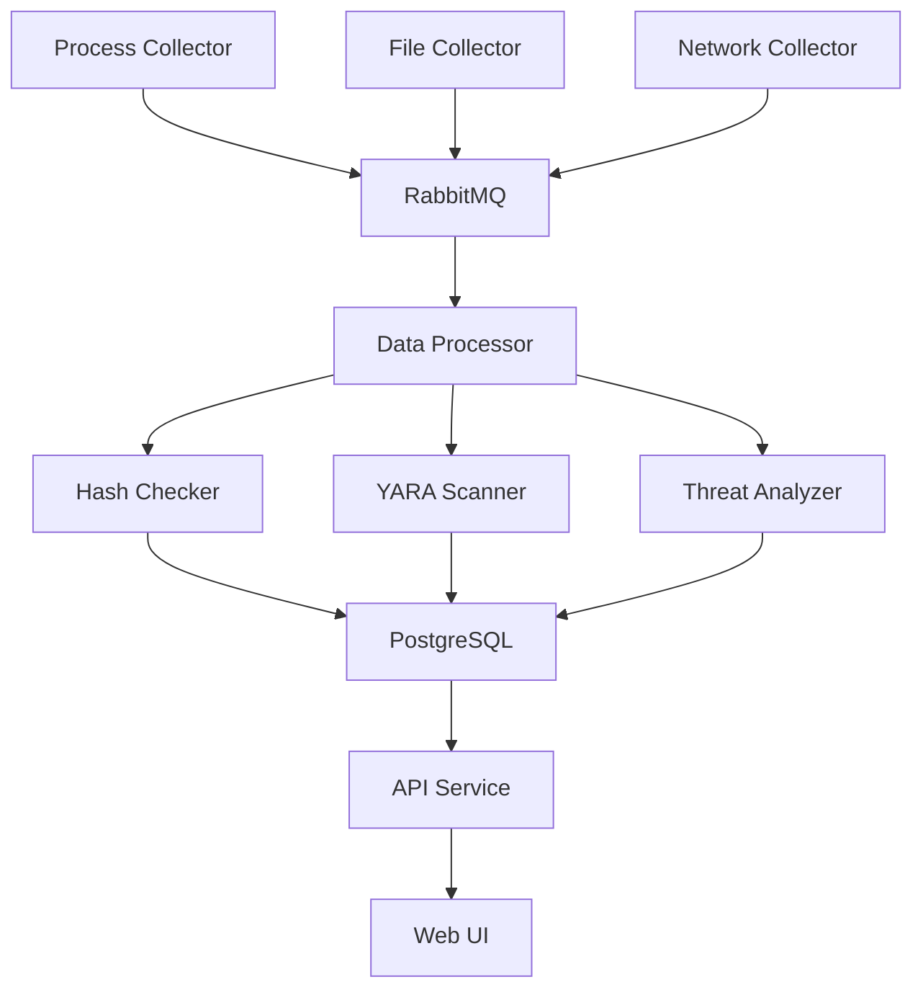

# 🚀 ZeroTrace Development Guide

## Quick Setup (First Time)

```bash
# 1. Clone and navigate to project
git clone <your-repo-url>
cd ZeroTrace

# 2. Validate your environment
./tools/development/scripts/validate-environment.sh

# 3. Setup development environment
make setup

# 4. Start development environment
make start

# 5. Verify everything works
make test
```

## 📋 Daily Development Workflow

### Starting Your Day
```bash
make start          # Start all services
make status         # Check service status
make shell          # Enter development container
```

### During Development
```bash
make build          # Build after changes
make test           # Run tests
make lint           # Check code quality
make format         # Format code
```

### Before Committing
```bash
make quality        # Run all quality checks
git add .
git commit -m "your message"  # Pre-commit hooks will run automatically
```

### Ending Your Day
```bash
make stop           # Stop all services (keeps data)
# OR
make clean          # Stop and remove containers (fresh start next time)
```

## 🏗️ Project Architecture

### Core Components

```
src/
├── api/                    # REST API (Python/FastAPI)
├── collectors/             # Data collectors (C++)
│   ├── process-collector/  # Process monitoring
│   ├── file-collector/     # File system monitoring
│   └── network-collector/  # Network monitoring
├── analyzers/              # Analysis engines (Python)
│   ├── hash-checker/       # Malware hash lookup
│   ├── yara-scanner/       # YARA rule scanning
│   └── threat-analyzer/    # Behavioral analysis
├── core/                   # Core services
│   └── data-processor/     # Central data processing
└── shared/                 # Shared components
    ├── data-schemas/       # Pydantic models
    ├── proto/              # Protocol buffers
    └── utils/              # Utility functions
```

### Service Communication



## 🛠️ Development Environment

### Container Services

| Service | Port | Purpose | Credentials |
|---------|------|---------|-------------|
| **API** | 8000 | REST API | - |
| **UI** | 3000 | Web Interface | - |
| **PostgreSQL** | 5432 | Database | zerotrace/dev_pass |
| **pgAdmin** | 5050 | DB Management | admin@zerotrace.local/admin |
| **RabbitMQ** | 5672 | Message Queue | zerotrace/zerotrace_dev_pass |
| **RabbitMQ UI** | 15672 | Queue Management | zerotrace/zerotrace_dev_pass |
| **Redis** | 6379 | Cache | - |

### Development Container

The development container includes:
- **Languages**: Python 3.9+, C++17, Node.js 18
- **Build Tools**: CMake, Make, GCC, Clang
- **Python Tools**: pip, venv, pytest, black, flake8, mypy
- **Quality Tools**: pre-commit, bandit, clang-format
- **Editors**: vim, nano (VSCode via Remote-Containers)

## 🧪 Testing Strategy

### Test Types
- **Unit Tests**: Individual component testing
- **Integration Tests**: Service interaction testing
- **End-to-End Tests**: Complete workflow testing
- **Performance Tests**: Load and stress testing

### Running Tests
```bash
# All tests
make test

# Specific test types
make test-unit
make test-integration
make test-e2e

# With coverage
make test-coverage

# Specific component
pytest tests/collectors/test_process_collector.py
```

## 🔍 Code Quality

### Automated Quality Checks
- **Python**: black, isort, flake8, mypy, bandit
- **C++**: clang-format, clang-tidy (planned)
- **Security**: bandit, trivy
- **Containers**: hadolint

### Pre-commit Hooks
Automatically run on every commit:
```bash
# Install hooks
make pre-commit-install

# Run manually
pre-commit run --all-files
```

### Manual Quality Checks
```bash
make lint           # Run all linters
make format         # Format all code
make security       # Security scans
make quality        # All quality checks
```

## 🐛 Debugging

### VSCode Debugging
Launch configurations are provided for:
- **Python API**: Debug FastAPI application
- **C++ Collectors**: Debug with GDB
- **Integration**: Debug full stack

### Log Files
```bash
make logs           # View all service logs
make logs api       # View API logs only
make logs collector # View collector logs only
```

### Container Debugging
```bash
make shell                    # Enter main dev container
make shell postgres          # Enter PostgreSQL container
make shell rabbitmq          # Enter RabbitMQ container

# Direct container access
docker exec -it zerotrace-dev bash
```

## 🔧 Common Development Tasks

### Adding a New Collector
1. Create directory: `src/collectors/new-collector/`
2. Add CMakeLists.txt
3. Implement in C++
4. Add tests
5. Update main CMakeLists.txt
6. Add to docker-compose if needed

### Adding a New Analyzer
1. Create directory: `src/analyzers/new-analyzer/`
2. Create Python module
3. Add to pyproject.toml dependencies
4. Implement Pydantic models in shared/data-schemas/
5. Add tests
6. Update API routes if needed

### Database Changes
1. Update models in `src/shared/data-schemas/`
2. Create migration script in `build/configs/database/`
3. Test with `make test-integration`
4. Update API documentation

## 📝 Coding Standards

### Python Style
- **Formatter**: Black (line length: 88)
- **Import sorting**: isort
- **Linting**: flake8
- **Type checking**: mypy
- **Docstrings**: Google style

### C++ Style
- **Standard**: C++17
- **Formatter**: clang-format (Google style, modified)
- **Naming**: snake_case for variables, PascalCase for classes
- **Documentation**: Doxygen style comments

### Git Workflow
- **Main branch**: `main` (protected)
- **Development**: `develop` branch
- **Features**: `feature/description` branches
- **Commits**: Conventional commit format
- **PR**: Required for main branch

## 🚨 Troubleshooting

### Common Issues

**Services won't start**
```bash
make status         # Check service status
make logs          # Check for errors
make reset         # Nuclear option - fresh start
```

**Build failures**
```bash
make clean         # Clean build artifacts
make setup         # Rebuild environment
```

**Permission issues (Linux)**
```bash
# Fix file permissions
sudo chown -R $USER:$USER .
```

**Docker issues**
```bash
# Clean Docker state
docker system prune -a
make reset
```

### Getting Help
1. Check logs: `make logs`
2. Validate environment: `./tools/development/scripts/validate-environment.sh`
3. Check documentation: `docs/`
4. Create GitHub issue with details

## 🎯 Next Steps

After setting up your environment:

1. **Explore the codebase**: Start with `src/api/main.py`
2. **Run tests**: `make test` to ensure everything works
3. **Make a small change**: Try modifying the API welcome message
4. **Check implementation roadmap**: `docs/implementation-roadmap.md`
5. **Pick your first task**: Start with Phase 1 components

Happy coding! 🚀
