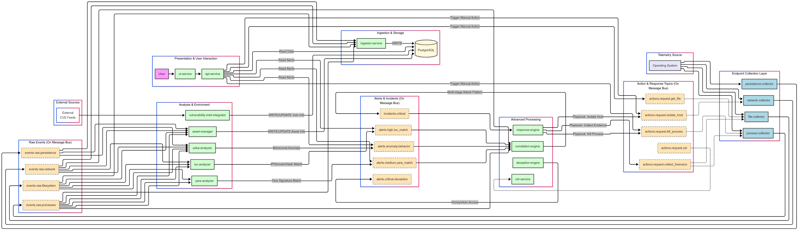

# ZeroTrace: A Modular, Event-Driven XDR Platform

## 1. Vision & Mission

**ZeroTrace** is an initiative to build a modern, extensible, and powerful Extended Detection and Response (XDR) platform from the ground up.

The mission is to create a robust security solution by leveraging a distributed microservices architecture. This approach is intentionally chosen to allow for **independent development, testing, and deployment of each component.** If development on one module stalls or proves too complex, work can continue on others without jeopardizing the entire project. This modularity is the core principle of ZeroTrace, designed for developers and researchers who want a flexible and resilient security platform.

## 2. Core Architecture

At its heart, ZeroTrace is an **event-driven system**. This architecture ensures true decoupling, scalability, and interactive capabilities.

-   **Asynchronous Communication:** All independent modules (microservices) communicate through a central **RabbitMQ Message Broker**. They do not know about each other's existence; they only know about the messages they produce or consume.
-   **Standardized Data:** All collectors are required to publish data using a **Common Data Schema** (inspired by ECS). This ensures that any analyzer can process data from any source without custom parsing logic, making the system truly modular.
-   **Bi-Directional Data Flow:**
    1.  **Telemetry Ingestion (`Collectors` -> `Analyzers`):** High-performance collectors gather raw telemetry and *publish* it to `events.raw.*` topics. Analyzers *subscribe* to this data.
    2.  **Interactive Actions (`API` -> `Collectors`):** The API or other services can *publish* tasks to `actions.request.*` topics to trigger on-demand actions on a specific collector (e.g., "kill process," "request file hash").

## 3. Technology Stack

The technologies for ZeroTrace are selected to use the right tool for the right job, prioritizing performance for data collection and flexibility for data analysis.

| Component          | Technology              | Rationale                                                                                                                   |
| :----------------- | :---------------------- | :-------------------------------------------------------------------------------------------------------------------------- |
| **Data Collectors** | **C++ / Rust** | For maximum performance, minimal system overhead, and direct access to low-level OS APIs.                                   |
| **Backend Services** | **Python 3** | For its rich ecosystem (data science, web frameworks, messaging libraries) and rapid development for analysis, API, and orchestration. |
| **Message Broker** | **RabbitMQ** | A mature, feature-rich message broker that provides flexible and reliable routing for our event-driven architecture.      |
| **Database** | **PostgreSQL** | A powerful, relational database with excellent support for `JSONB`, allowing us to store structured and unstructured data efficiently. |
| **Orchestration** | **Docker & Docker Compose**| To containerize each microservice, ensuring a consistent, isolated, and easily reproducible development and deployment environment. |
| **Frontend** | **JavaScript (React/Vue)** | To build a modern, interactive, and responsive web interface for users to analyze data and manage the system.                |

## 4. Current Project Status

**As of June 16, 2025:**

-   **Status:** **In Planning & Early Development**
-   **Current Focus:** **Phase 1 - Foundation & Core Collection**. The primary goal is to establish the core infrastructure (Docker, RabbitMQ, Postgres), define the data schema, and develop the initial collectors and the Python `ingestor-service`.

---

## 5. Development Roadmap

The project is broken down into four main phases, designed to deliver value incrementally.

### Phase 1: Foundation & Core Collection
*The goal of this phase is to build the backbone of the system and reliably collect and store essential endpoint data.*
-   [ ] **Infrastructure Setup:** Configure Docker Compose to orchestrate RabbitMQ and PostgreSQL containers.
-   [ ] **Define Common Data Schema:** Design and document a standard JSON format for all events to ensure system-wide consistency.
-   [ ] **Core Collectors:** Develop the C++ `process-collector` and `network-collector`.
-   [ ] **Ingestion Service:** Create the Python `ingestor-service` to consume raw events and persist them to PostgreSQL.
-   [ ] **Basic API & UI:** Implement a rudimentary API and UI to confirm that data is flowing and being stored correctly.

### Phase 2: Initial Detection & Context Expansion
*The goal of this phase is to move from data collection to active threat detection by adding initial analyzers and deeper data sources.*
-   [ ] **IOC Analyzer:** Develop the service to match data against threat intelligence feeds.
-   [ ] **Yara Analyzer:** Develop the service to scan files based on Yara rules, triggered by file-related events.
-   [ ] **Persistence Collector:** Add the new C++ collector for detecting common persistence techniques.
-   [ ] **Alert Visualization:** Enhance the UI to display and manage alerts generated by the analysis services.

### Phase 3: Advanced Correlation & Intelligence
*The goal of this phase is to transform the system into a true XDR by connecting dots, understanding context, and building a comprehensive asset view.*
-   [ ] **Filesystem Collector:** Add the C++ collector for real-time file system monitoring.
-   [ ] **Correlation Engine:** Develop the core "brain" to identify multi-stage attack patterns.
-   [ ] **Asset Management Service:** Create a service to build and maintain profiles of monitored assets.
-   [ ] **Vulnerability Intel Integrator:** Add a service to enrich asset data with known CVE information.

### Phase 4: Proactive Defense & Automated Response
*The goal of this phase is to add next-generation detection, automation, and deep investigation capabilities.*
-   [ ] **Response Engine (SOAR-lite):** Implement a playbook engine for automated incident response.
-   [ ] **Content Disarm & Reconstruction (CDR) Service:** Build a service to sanitize potentially malicious files.
-   [ ] **Deception Engine:** Implement honeytoken/honeyfile capabilities to proactively detect intruders.
-   [ ] **On-Demand Forensics Collector:** Add the capability to perform deep forensic data collection when triggered by a critical incident.
-   [ ] **UEBA / ML Analyzer:** Develop a service for detecting behavioral anomalies.

---

## 6. Comprehensive Module Breakdown

### Core Modules (Phase 1-2)

-   **`process-collector` (C++)**
    -   **Responsibility:** Gathers detailed information about process creation/termination.
    -   **Publishes to Topic:** `events.raw.processes`
    -   **Listens to (for Actions):** `actions.request.kill_process`, `actions.request.get_process_details`

-   **`network-collector` (C++)**
    -   **Responsibility:** Gathers detailed information about network connections (TCP/UDP).
    -   **Publishes to Topic:** `events.raw.network`
    -   **Listens to (for Actions):** `actions.request.isolate_host`

-   **`ingestor-service` (Python)**
    -   **Responsibility:** Subscribes to all raw data topics (`events.raw.*`) and reliably persists the event data into PostgreSQL.
    -   **Listens to Topics:** `events.raw.*`

-   **`ioc-analyzer` (Python)**
    -   **Responsibility:** Matches network, process, and file data against known bad indicators from threat intelligence feeds.
    -   **Listens to Topics:** `events.raw.network`, `events.raw.processes`, `events.raw.filesystem`
    -   **Publishes to Topic:** `alerts.high.ioc_match`

-   **`yara-analyzer` (Python)**
    -   **Responsibility:** Scans files associated with events against a ruleset of Yara signatures.
    -   **Listens to Topics:** `events.raw.processes`, `events.raw.filesystem`
    -   **Publishes to Topic:** `alerts.medium.yara_match`
    -   **Sends Actions to:** `actions.request.get_file_content`

-   **`persistence-collector` (C++)**
    -   **Responsibility:** Monitors for changes in common system persistence locations.
    -   **Publishes to Topic:** `events.raw.persistence`

-   **`api-service` (Python)**
    -   **Responsibility:** Provides a secure RESTful API for the frontend to query data and initiate actions.
    -   **Input:** HTTP Requests from UI
    -   **Output:** JSON data to UI, messages to `actions.request.*` topics.

-   **`ui-service` (JavaScript)**
    -   **Responsibility:** Provides the user-facing web dashboard for visualization and interaction.
    -   **Input:** User interaction
    -   **Output:** HTTP Requests to `api-service`

### Advanced & Future Modules (Phase 3-4)

-   **`file-collector` (C++)**
    -   **Responsibility:** Monitors critical files and directories for changes (create, modify, delete).
    -   **Publishes to Topic:** `events.raw.filesystem`
    -   **Listens to (for Actions):** `actions.request.get_file_content`, `actions.request.quarantine_file`

-   **`correlation-engine` (Python)**
    -   **Responsibility:** The "brain" of the XDR. Subscribes to multiple event and alert streams to identify complex attack patterns.
    -   **Listens to Topics:** `alerts.*`, `events.raw.*`
    -   **Publishes to Topic:** `incidents.critical`

-   **`asset-manager` (Python)**
    -   **Responsibility:** Creates and maintains a profile/inventory of each monitored host, providing crucial context for all alerts.
    -   **Listens to Topics:** `events.raw.*`
    -   **Output:** Enriches the PostgreSQL `Assets` Table

-   **`vulnerability-intel-integrator` (Python)**
    -   **Responsibility:** Periodically connects to vulnerability data sources to enrich asset data with known CVEs.
    -   **Input:** External vulnerability APIs/feeds
    -   **Output:** Enriches the `Assets` Table in PostgreSQL.

-   **`response-engine` (Python)**
    -   **Responsibility:** The SOAR component. Executes automated response playbooks when critical incidents are detected.
    -   **Listens to Topic:** `incidents.critical`
    -   **Publishes to Topics:** `actions.request.isolate_host`, `actions.request.kill_process`, `actions.request.collect_forensics`, etc.

-   **`cdr-service` (Python)**
    -   **Responsibility:** Sanitizes files by stripping them of potentially malicious active content.
    -   **Listens to Topic:** `actions.request.cdr`
    -   **Publishes to Topic:** `actions.response.cdr`

-   **`deception-engine` (Python)**
    -   **Responsibility:** Creates and manages local "honey-tokens." A separate listener component would monitor for their use.
    -   **Publishes to Topic:** `alerts.critical.deception` when a decoy is accessed.

-   **`on-demand-forensics-collector` (C++/Python)**
    -   **Responsibility:** A special collector, triggered by the `response-engine`, to collect deep forensic data (memory dump, MFT, etc.).
    -   **Listens to Topic:** `actions.request.collect_forensics`
    -   **Output:** A packaged archive sent to a secure storage location.

-   **`ueba-analyzer` (Python)**
    -   **Responsibility:** Uses machine learning to baseline normal behavior and detect anomalous deviations.
    -   **Listens to Topics:** `events.raw.*`
    -   **Publishes to Topic:** `alerts.anomaly.behavior`

## 7. How to Contribute

This is currently a personal academic project. However, if you are interested in collaborating or have suggestions, please feel free to open an issue on the project's GitHub repository.

## 8. Author

-   **[Ekrem Ünal / Ekremunalytu]**
-   [https://github.com/Ekremunalytu]
-   [https://www.linkedin.com/in/ekrem-ünal-440002232/]